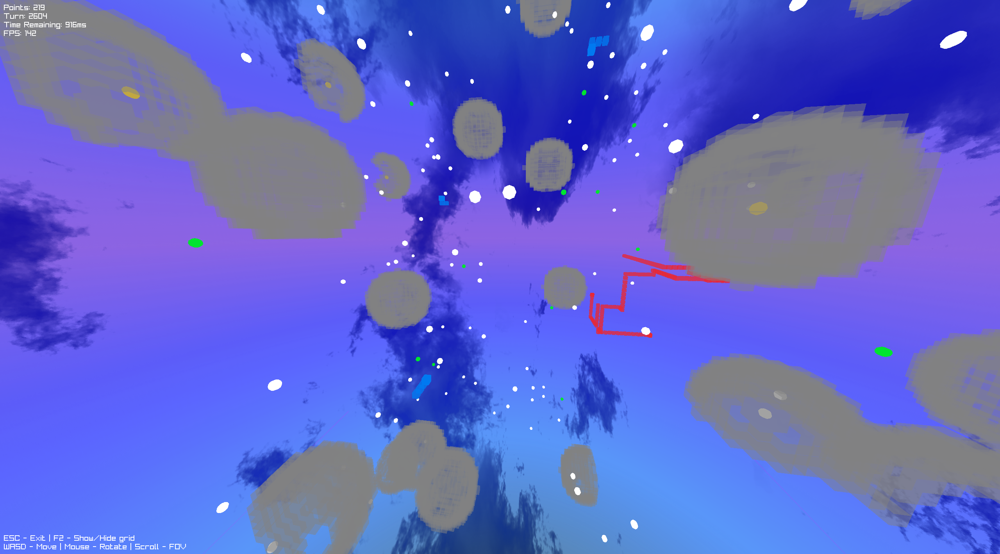

<a name="readme-top"></a>

<details>
  <summary>Table of Contents</summary>
  <ol>
    <li>
      <a href="#about-the-project">About The Project</a>
    </li>
    <li>
      <a href="#getting-started">Getting Started</a>
      <ul>
        <li><a href="#requirements">Requirements</a></li>
        <li><a href="#how-to-build">How to build</a></li>
      </ul>
    </li>
    <li><a href="#license">License</a></li>
    <li><a href="#contact">Contact</a></li>
  </ol>
</details>

## About The Project

A solution for gamathon DatsNewWay.



## Getting Started

### Requirements

* C++23 compiler support

### Dependencies

* [spdlog](https://github.com/gabime/spdlog)
* [glaze](https://github.com/stephenberry/glaze)
* [cpr](https://github.com/libcpr/cpr)

### How to build

1. Install dependencies
2. Clone the repo

```sh
git clone https://github.com/RexarX/Gamathon2024.git
git submodule update --init --recursive
cd Gamathon2024
```

3. Build with cmake

```sh
mkdir build
cd build
cmake ..
```

## License

Distributed under the Unlicense license. See `LICENSE` for more information.

## Contact

RexarX - who727cares@gmail.com
PlatonFPS - platonfps@yandex.ru

<p align="right">(<a href="#readme-top">back to top</a>)</p>
